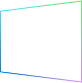

<!-- 
This README describes the package. If you publish this package to pub.dev,
this README's contents appear on the landing page for your package.

For information about how to write a good package README, see the guide for
[writing package pages](https://dart.dev/guides/libraries/writing-package-pages). 

For general information about developing packages, see the Dart guide for
[creating packages](https://dart.dev/guides/libraries/create-library-packages)
and the Flutter guide for
[developing packages and plugins](https://flutter.dev/developing-packages). 
-->

Nacey's Flutter Tools
=


This project was created with the idea of being able to use one widget and have it behave more platform specific.
We are starting with the Buttons and form field inputs.  Eventually we would like to move up to entire scaffolds and forms.
We have done our best to match the padding, fonts, etc from the various branding materials available on the web.
If something is wrong, please msg with the issue and a reference link to the correct info.
### Here are the resources we used to make these decisions.
#### iOS
[Human Interface Guidelines](https://developer.apple.com/design/human-interface-guidelines/ios/overview/themes/)
#### macOS
[Human Interface Guidelines](https://developer.apple.com/design/human-interface-guidelines/macos/overview/themes/)
#### android
[Material Design](https://material.io/)
#### Windows
[Fluent Design System](https://www.microsoft.com/design/fluent/#/) 
#### <span style="color:red;">Linux</span>
<span style="color:orange;">???</span>
#### <span style="color:red;">Web</span>
<span style="color:orange;">???</span>


## Features

### [Buttons](./lib/widgets/README.md)
TODO: List what your package can do. Maybe include images, gifs, or videos.

## Getting started

TODO: List prerequisites and provide or point to information on how to
start using the package.

## Usage

TODO: Include short and useful examples for package users. Add longer examples
to `/example` folder. 

```dart
const like = 'sample';
```

## Additional information

TODO: Tell users more about the package: where to find more information, how to 
contribute to the package, how to file issues, what response they can expect 
from the package authors, and more.
