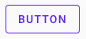
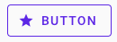
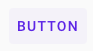
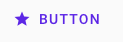
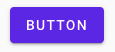
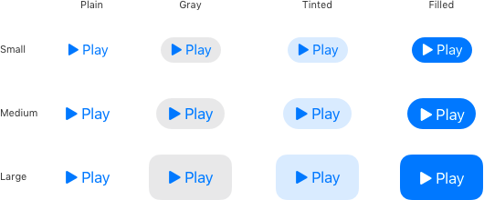
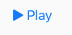
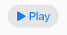
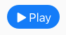

Widgets
=
Here are where the widgets are!

Buttons
-
<p>The <span style="color:slateblue;">NButton</span> extends the <span style="color:slateblue;">ButtonStyleButton</span> class.
You should be able to use any of the inputs that you would use for that type of button in any other flutter project and get a working button.
That button should conform to the basic guidelines and look and feel like system buttons.</p>
<p>We have actually created 5 types of <span style="color:slateblue;">NButton</span>s: Outlined, Flat, Grey, Tinted, and Filled.
These came mainly from Material Design and Human Interface Guidelines</p>

#### This table shows the button types as they appear in this set as headers and their equivalent in established systems.

<table style="border: 3px solid red;font-size: 24px;">
    <thead>
        <tr style="text-align:center;border-bottom: 1px solid red;font-family: Copperplate, Papyrus, fantasy">
            <th style="background:goldenrod;"></th>
            <th style="background:goldenrod;color:ghostwhite;">Outlined</th>
            <th style="background:goldenrod;color:ghostwhite;">Flat</th>
            <th style="background:goldenrod;color:ghostwhite;">Grey</th>
            <th style="background:goldenrod;color:ghostwhite;">Tinted</th>
            <th style="background:goldenrod;color:ghostwhite;">Filled</th>
        </tr>
    </thead>
    <tbody>
        <tr style="text-align:center;border-bottom: 1px solid red;font-family: Roboto, Helvetica, sans-serif">
            <td style="background:mintcream;color:darkolivegreen;text-align:right;border-right: 3px solid red;">Material</td>
            <td style="background:snow;color:darkslategrey;">Outlined</td>
            <td style="background:snow;color:darkslategrey;">Text</td>
            <td style="background:snow;color:darkslategrey;">-</td>
            <td style="background:snow;color:darkslategrey;">-</td>
            <td style="background:snow;color:darkslategrey;">Contained</td>
        </tr>
        <tr style="text-align:center;font-family: SanFrancisco-Compact, Monaco, monospace">
            <td style="background:azure;color:mediumblue;text-align:right;border-right: 3px solid red;">Human Interface</td>
            <td style="background:snow;color:darkslategrey;">-</td>
            <td style="background:snow;color:darkslategrey;">Plain</td>
            <td style="background:snow;color:darkslategrey;">Gray</td>
            <td style="background:snow;color:darkslategrey;">Tinted</td>
            <td style="background:snow;color:darkslategrey;">Filled</td>
        </tr>
    </tbody>
</table>

---

### [Material Button types](https://material.io/components/buttons)

#### Outlined


```dart
  final NButton button = NButton(child: Text('Button'), onPressed: (){}, useMaterial: true);
```



```dart
  final NButtonWithIcon button = NButtonWithIcon(icon: Icon(Icons.star), label: 'Button', onPressed: (){}, useMaterial: true);
  final NButtonWithIcon button = NButton.icon(icon: Icon(Icons.star), label: 'Button', onPressed: (){}, useMaterial: true);
```

#### Text


```dart
  final NButtonFlat button1 = NButtonFlat(child: Text('Button'), onPressed: (){}, useMaterial: true);
  final NButtonFlat button2 = NButton.flat(child: Text('Button'), onPressed: (){}, useMaterial: true);
```



```dart
  final NButtonFlatWithIcon button1 = NButtonFlatWithIcon(icon: Icon(Icons.star), label: 'Button', onPressed: (){}, useMaterial: true);
  final NButtonFlatWithIcon button2 = NButton.flatWithIcon(icon: Icon(Icons.star), label: 'Button', onPressed: (){}, useMaterial: true);
```

#### Contained


```dart
  final NButtonFilled button1 = NButtonFilled(child: Text('Button'), onPressed: (){}, useMaterial: true);
  final NButtonFilled button2 = NButton.filledWithIcon(child: Text('Button'), onPressed: (){}, useMaterial: true);
```


```dart
  final NButtonFilledWithIcon button1 = NButtonFilledWithIcon(icon: Icon(Icons.star), label: 'Button', onPressed: (){}, useMaterial: true);
  final NButtonFilledWithIcon button2 = NButton.filledWithIcon(icon: Icon(Icons.star), label: 'Button', onPressed: (){}, useMaterial: true);
```

---

### [Human Interface types](https://developer.apple.com/design/human-interface-guidelines/ios/controls/buttons/)


#### Plain


#### Gray


#### Tinted


#### Filled

