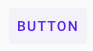
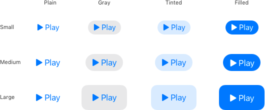
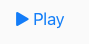
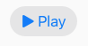
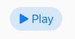

Buttons
=

Regular buttons
-

### [Material Button types](https://material.io/components/buttons)

#### Outlined


```dart
  final NButton button = NButton(child: Text('Button'), onPressed: (){}, useMaterial: true);
```


```dart
  final NButtonWithIcon button = NButtonWithIcon(icon: Icon(Icons.star), label: 'Button', onPressed: (){}, useMaterial: true);
  final NButtonWithIcon button = NButton.icon(icon: Icon(Icons.star), label: 'Button', onPressed: (){}, useMaterial: true);
```

#### Text


```dart
  final NButtonFlat button1 = NButtonFlat(child: Text('Button'), onPressed: (){}, useMaterial: true);
  final NButtonFlat button2 = NButton.flat(child: Text('Button'), onPressed: (){}, useMaterial: true);
```


```dart
  final NButtonFlatWithIcon button1 = NButtonFlatWithIcon(icon: Icon(Icons.star), label: 'Button', onPressed: (){}, useMaterial: true);
  final NButtonFlatWithIcon button2 = NButton.flatWithIcon(icon: Icon(Icons.star), label: 'Button', onPressed: (){}, useMaterial: true);
```

#### Contained


```dart
  final NButtonFilled button1 = NButtonFilled(child: Text('Button'), onPressed: (){}, useMaterial: true);
  final NButtonFilled button2 = NButton.filledWithIcon(child: Text('Button'), onPressed: (){}, useMaterial: true);
```


```dart
  final NButtonFilledWithIcon button1 = NButtonFilledWithIcon(icon: Icon(Icons.star), label: 'Button', onPressed: (){}, useMaterial: true);
  final NButtonFilledWithIcon button2 = NButton.filledWithIcon(icon: Icon(Icons.star), label: 'Button', onPressed: (){}, useMaterial: true);
```

---

### [Human Interface types](https://developer.apple.com/design/human-interface-guidelines/ios/controls/buttons/)


<table>
    <tbody>
        <tr>
            <td><h4>Plain</h4></td>
            <td><h4>Gray</h4></td>
            <td><h4>Tinted</h4></td>
            <td><h4>Filled</h4></td>
        </tr>
        <tr>
            <td></td>
            <td></td>
            <td></td>
            <td></td>
        </tr>
    </tbody>
</table>


